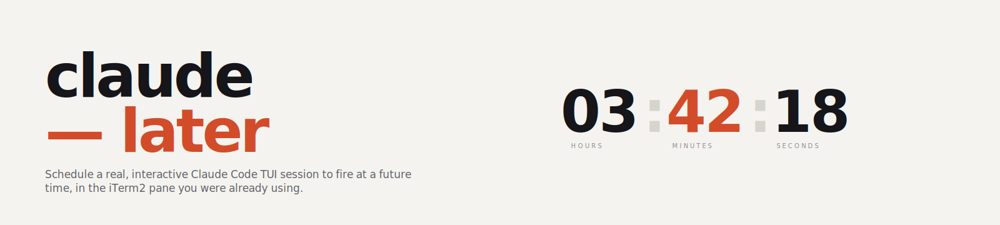

<picture>
  <source media="(prefers-color-scheme: dark)" srcset="assets/hero-dark.svg">
  
</picture>

# claude-later

[](https://github.com/ajanderson1/claude-later/releases)
[](LICENSE)
[](#compatibility)
[](#compatibility)
[](#status)

**Schedule a real, interactive Claude Code TUI session to fire at a future time from an iTerm2 pane.**

You type a command. The script arms itself, holds the pane, and then fires at the appointed time — booting `claude` in the pane you've been watching, typing your prompt into the input box, and pressing Enter as if a human had been sitting at the keyboard.

Not `claude -p`. Not headless. Not a sidebar. **A real TUI session you can watch happen and take over with your keyboard.**


*Arm with `--interactive`, watch the ARMED banner and pre-flight summary, then `claude` boots at T-0 and the prompt is typed into the live TUI.*

---

## What it's for

The specific workflows `claude-later` exists to solve:

1. **Rate-limit recovery.** You hit Claude Code's 5-hour session limit at 10am. The reset is at 2pm. You want to arm a `claude --resume <uuid>` for 2:05pm and walk away. Built-in `/loop` can't do this because it's session-scoped and dies with the rate-limited session. `claude-later` fires a fresh process at fire time and can re-enter the old session via `--resume`.

2. **Overnight runs.** You want Claude to review yesterday's commits at 6am and have a real conversation waiting for you when you sit down at your desk — in the pane you were working in last night, with your git worktree, your environment, your scrollback.

3. **Long-delayed handoffs.** "Start the nightly refactor at midnight, resume session `abc123`, and take it from there." You don't want a headless run that produces a text dump. You want an actual live TUI session you can jump into.

Everything else — the pre-flights, caffeinate wrap, state files, tombstones — exists because those workflows happen **while you're not watching**, and silent failures are worse than loud ones.

## Why not just use `/loop` or Desktop Scheduled Tasks?

Anthropic has shipped three scheduling mechanisms. None of them fits the above use cases:

| Feature                     | `/loop` (CLI) | Desktop Scheduled Tasks | Cloud Scheduled Tasks | **claude-later** |
| --------------------------- | :-----------: | :---------------------: | :-------------------: | :--------------: |
| Fires without a live session|       ❌       |            ✅           |           ✅          |         ✅        |
| Runs in your existing pane  |       ✅       |            ❌           |           ❌          |         ✅        |
| Works in iTerm2 CLI only    |       ✅       |            ❌           |           ❌          |         ✅        |
| Survives rate-limit reset   |       ❌       |            ✅           |           ✅          |         ✅        |
| `--resume` a specific UUID  |       ❌       |            ❌           |           ❌          |         ✅        |
| No Desktop app dependency   |       ✅       |            ❌           |           ✅          |         ✅        |
| Local file access           |       ✅       |            ✅           |           ❌          |         ✅        |
| Human-watchable fire moment |     partial    |            ❌           |           ❌          |         ✅        |
| One-shot scheduling         |       ❌*      |            ✅           |           ✅          |         ✅        |

<sub>* `/loop` supports one-off reminders but only within a running session. They die if the session exits.</sub>

The niche `claude-later` fills: **terminal-native interactive-TUI-takeover scheduling on your local working directory, with no Desktop app dependency, on the pane you were already using**.

## Compatibility

`claude-later` is intentionally **narrow**. It targets one specific environment and refuses to run outside it.

| Requirement                      | Why                                                                                                     |
| -------------------------------- | ------------------------------------------------------------------------------------------------------- |
| **macOS** (Darwin)               | Uses BSD `date -j -f`, `caffeinate`, `pmset`, and `swift -e 'import Carbon'` for Secure Input detection |
| **iTerm2** (not Terminal.app)    | Requires iTerm2's native AppleScript dictionary for keystroke injection into live panes                 |
| **Not inside tmux/screen**       | Keystroke targeting goes through the iTerm2 session UUID in `$ITERM_SESSION_ID`; tmux breaks that link  |
| **Bash 3.2+**                    | The system bash that ships with macOS works                                                             |
| **Claude Code** on `PATH`        | Obviously                                                                                               |
| **`jq`**                         | State file construction                                                                                 |
| **Xcode Command Line Tools**     | Provides `swift` for Secure Input detection                                                             |
| **iTerm2 Automation permission** | System Settings → Privacy & Security → Automation → (your shell's parent) → iTerm2                      |

### Pre-flight will tell the user exactly what's missing

The script runs 13 pre-flight checks the moment you invoke it — **not at fire time** — and aborts loudly with an actionable message on any failure. A user who runs `claude-later` in the wrong environment gets a specific error in under a second, not a silent failure six hours later. See the [Robustness](#robustness) section below.

### Will this work for a new user out of the box?

**Yes, if they match the compatibility matrix above.** Realistic assessment for a Claude Code user:

| User profile                                      | Works out of the box? |
| ------------------------------------------------- | :-------------------: |
| macOS + iTerm2 + Homebrew + Xcode CLT + claude    |           ✅           |
| macOS + iTerm2 + claude, no Homebrew              |   ⚠️ install `jq`      |
| macOS + iTerm2 + claude, no Xcode CLT             |   ⚠️ install CLT       |
| macOS + Terminal.app                              |           ❌           |
| macOS + Ghostty / Alacritty / Kitty               |           ❌           |
| macOS + iTerm2 inside tmux                        |           ❌           |
| Linux / Windows / WSL                             |           ❌           |

For broader compatibility plans, see [ROADMAP.md](ROADMAP.md).

## Install

```sh
git clone https://github.com/ajanderson1/claude-later.git ~/GitHub/claude-later
ln -s ~/GitHub/claude-later/claude-later /usr/local/bin/claude-later
claude-later --version  # should print: claude-later 0.3.1
```

First time you run `claude-later`, macOS will prompt for permission for your shell's parent process (iTerm2 or the process invoking it) to control iTerm2 via AppleScript. Grant it — this is System Settings → Privacy & Security → Automation.

Also run `claude` once in whatever directory you plan to use `claude-later` from, to clear any first-run trust prompts. Pre-flight refuses to arm if `~/.claude/projects/-<slug>/` doesn't exist for the current directory.

## Quickstart

Open an iTerm2 pane in a directory where you've run `claude` before, and arm a fire 10 seconds out:

```sh
claude-later --in 10s "say hello in 3 words"
```

You'll see the ARMED banner, a live countdown, and at T-0 `claude` boots in the same pane and types the prompt. Press `Ctrl+C` during the countdown to cancel.

## Usage

The message is a single-line trailing positional argument. Quoted. Non-printable characters and embedded newlines are rejected.

### Basic

```sh
# Fire in 4 hours with a fresh session
claude-later --in 4h "review the open PRs and summarize"

# Fire at 06:30 tomorrow (rolls to next day automatically if already past)
claude-later --at 06:30 "morning standup prep from today's commits"

# Absolute date and time
claude-later --at "2026-04-09 03:00" "run the nightly refactor"

# Pass flags through to claude at fire time (model, teammate mode, etc.)
claude-later --in 4h --claude-args "--model opus --teammate-mode tmux" "deep refactor"

# Resume a specific prior session at fire time
claude-later --in 30m --claude-args "--resume 7f3a4c12-0000-4000-8000-000000000000" "continue where we left off"

# Dry-run: all pre-flights + ARMED banner, exit without scheduling
claude-later --dry-run --in 1m "test"
```

### Passing flags to `claude` at fire time (`--claude-args`)

v0.2 introduced `--claude-args` as a transparent passthrough for any claude
flag on an allowlist. This replaces v0.1's dedicated `--resume` flag —
resume now lives inside `--claude-args`. Every sub-flag is validated at
**arm time** against both an allowlist and a blocklist, with explicit
error messages.

```sh
# Model selection
claude-later --in 1h --claude-args "--model opus" "..."

# Teammate mode (for users whose cc wrapper uses --teammate-mode tmux)
claude-later --in 1h --claude-args "--teammate-mode tmux" "..."

# Multiple flags
claude-later --in 1h --claude-args "--teammate-mode tmux --model opus --effort high" "..."

# Session resume by UUID (rate-limit recovery)
claude-later --at 14:05 --claude-args "--resume 7f3a4c12-0000-4000-8000-000000000000" "continue"

# Session resume by name (convenience — resolved at arm time)
# Use `/rename` inside a Claude Code session to set a display name first.
claude-later --at 14:05 --claude-args "--resume-name nightly-refactor" "continue"
```

**Allowlist** (only these sub-flags may appear inside `--claude-args`):
`--resume` / `-r`, `--resume-name` (synthetic — see below), `--continue` / `-c`,
`--model`, `--teammate-mode`, `--agent`, `--effort`, `--permission-mode`,
`--name` / `-n`, `--append-system-prompt`, `--system-prompt`, `--fork-session`,
`--add-dir`, `--mcp-config`, `--settings`.

**Blocklist** (hard reject with a specific reason):
`-p` / `--print` (headless, defeats the purpose), `-h` / `--help` and
`-v` / `--version` (exit immediately), `--bare` (skips CLAUDE.md and
hooks), `--dangerously-skip-permissions`, `-d` / `--debug` / `--debug-file`
(breaks TUI rendering), `-w` / `--worktree` (changes cwd at fire time and
violates the first-run hygiene pre-flight), `--session-id` (fixed session
IDs conflict with fresh-session assumptions).

**Limitations**:
- Word-splitting is whitespace-only. No shell quoting is honored inside
  the `--claude-args` string. Single and double quote characters are
  rejected at pre-flight to prevent silent mis-parsing.
- No flag allowed by claude outside the allowlist is permitted. If you
  need a flag that isn't on the list, open an issue — adding flags is
  cheap.

#### `--resume-name NAME` (synthetic convenience)

`--resume-name` is not a real claude flag. It's a claude-later synthetic
that scans the current cwd's Claude Code transcripts (`~/.claude/projects/-<cwd-slug>/*.jsonl`)
for a session with a matching `/rename`'d display name, then rewrites the
sub-flag to `--resume <uuid>` before firing. The banner shows both the
name and the resolved UUID so you see exactly what will fire:

```text
Invocation: claude --teammate-mode tmux --resume 1048088f-05c8-4140-9098-ea9590db9bf6
            (resolved --resume-name TESTING_V0.2 -> 1048088f-05c8-4140-9098-ea9590db9bf6)
```

Rules:
- **Exact match only**, no wildcards or substring matching.
- **Only the current cwd's project dir is searched** — same scope as the
  `--resume UUID` transcript-existence check.
- **Zero matches** aborts with `no session named '<name>' found in <dir>`.
- **Multiple matches** aborts with a list of matching UUIDs so you can
  disambiguate manually via `--resume <uuid>`.
- **Cannot be combined with `--resume`** — they target the same thing.
- **May only appear once.**

To give a session a display name, use the `/rename` slash command inside
a running Claude Code session:

```text
/rename nightly-refactor
```

This writes a `custom-title` event into the transcript that `--resume-name`
then matches against.

### Prompt from a variable

```sh
PROMPT="review the open PRs in this repo and write a short summary"
claude-later --in 8h "$PROMPT"
```

### Prompt from a file (must be a single line)

```sh
# File contains one line, no trailing wrap
claude-later --in 1h "$(cat ~/prompts/nightly-review.txt)"

# File has wrapped lines → flatten
claude-later --in 1h "$(tr '\n' ' ' < ~/prompts/nightly-review.txt | sed 's/  */ /g')"
```

### Rate-limit recovery

The most compelling real-world use case. Claude Code's 5-hour session limit hard-stops with no auto-resume — when you hit it, the process exits and Anthropic has [declined to ship auto-resume](https://github.com/anthropics/claude-code/issues/13354).

```sh
# Scenario: hit the limit at 10am, reset at 2pm, session UUID printed by claude
claude-later --at 14:05 --claude-args "--resume 7f3a4c12-0000-4000-8000-000000000000" "continue where we left off"
```

At 14:05 the script fires a fresh `claude --resume <uuid>` in your pane and types the prompt. Because it's a new process, the rate-limit counter is already reset at the provider level — no state-resurrection shenanigans. The resume UUID is validated against the UUID regex at arm time and the transcript file is checked for existence, so typos are caught loudly before you walk away.

### Interactive mode

If you forget the flag syntax, run the wizard:

```sh
claude-later --interactive    # or -i
```

It asks four questions (when, resume?, extra flags, message), validates each as you type, and shows the equivalent non-interactive command before arming:

```
This is equivalent to running:
  claude-later --in 4h --claude-args "--resume-name nightly" "review the PRs"
Proceed? [Y/n]
```

Type `!abort` at any prompt to exit cleanly.

## Options

| Flag                    | Description                                                                                            |
| ----------------------- | ------------------------------------------------------------------------------------------------------ |
| `--at TIME`             | Absolute: `HH:MM`, `HH:MM:SS`, `YYYY-MM-DD HH:MM`, `YYYY-MM-DD HH:MM:SS`. Rolls to tomorrow if past.   |
| `--in DURATION`         | Relative: `30s`, `5m`, `4h`, `2h30m`, `1d12h`, etc.                                                    |
| `--claude-args "..."`   | Whitespace-separated passthrough of flags to `claude` at fire time. See the dedicated section above.   |
| `--dry-run`             | Run pre-flights + ARMED banner, then exit without scheduling.                                          |
| `--interactive`, `-i`   | Walk through scheduling with a guided wizard.                                                          |
| `--no-caffeinate`       | Skip the auto-re-exec under `caffeinate -dimsu`. Use only if you know the Mac will stay awake.         |
| `--allow-battery`       | Allow arming on battery power. Script warns but proceeds.                                              |
| `--log-pane-snapshots`  | Capture full pane contents into the log on each helper poll. Debugging use.                            |
| `--skip-mcp-check`      | Bypass the MCP auth-pending pre-flight. Use when the auth cache is stale or being rewritten.           |
| `--help`, `-h`          | Print help.                                                                                            |
| `--version`             | Print version.                                                                                         |

## Robustness

Every pre-flight runs the moment you invoke the command. The script aborts loudly on any failure with a specific, actionable error. Checks:

1. Running on macOS
2. `TERM_PROGRAM=iTerm.app`, not inside tmux/screen
3. `$ITERM_SESSION_ID` present and correctly formatted
4. Required binaries: `claude`, `osascript`, `caffeinate`, `jq`, `swift`, `pmset`
5. Time parses, is in the future, and is not inside a DST gap
6. `--claude-args` sub-flags pass the allowlist/blocklist, quote characters rejected, and if `--resume UUID` is present the UUID is validated and the transcript file checked
7. Message is non-empty, single-line, printable only
8. iTerm2 scripting can reach the current session (with classified error hints: automation denied / iTerm2 quit / session closed)
9. Secure Input is not engaged (1Password unlock, lock screen, etc.)
10. Running on AC power (unless `--allow-battery`)
11. **First-run hygiene:** `claude` has run in this directory before (trust-folder modal won't appear at fire time)
12. **MCP auth pending:** no MCP servers are waiting for interactive OAuth (modal won't appear at fire time)
13. No other `claude-later` is already armed in this pane

After arming, the script re-execs under `caffeinate -dimsu`, sleeps until T−5s, spawns a detached helper, runs one more batch of pre-fire checks, and `exec`s `claude` in-place. The helper polls iTerm2 from outside the exec'd process until the steady-state TUI prompt is detected via stable-hash + `❯` glyph match, then:

1. Rechecks Secure Input (defense against screen-lock between arm and fire)
2. Sends `Ctrl+U` to clear the TUI input buffer (residual pty bytes, user keystrokes, etc.)
3. Types the message via `osa_write_text` with `newline YES` — iTerm2's native scripting delivers real keyboard input into Claude Code's TUI input box (validated by Unit 0 spike #5)

Polling uses a tail-sliced fetch (last 80 lines of scrollback) so the detector is resilient to window resize and doesn't pay osascript latency on large histories. If the splash screen is drawn but `❯` hasn't appeared yet, the helper keeps polling until the readiness deadline — Claude Code takes ~9 seconds from `exec` to fully-drawn input box.

### Failure modes with explicit tombstones

Every failure writes a structured status into the state file and fires a macOS notification. Tombstone classes:

- `delivered` — success
- `tui_not_ready` — the TUI didn't reach `❯` within the readiness budget
- `session_died` — iTerm2 session was closed during the helper's run
- `secure_input_engaged` — Secure Input engaged between arm and fire
- `unexpected_modal` — stable contents but no `❯` glyph (legacy; now handled via keep-polling)
- `write_failed` — `osa_write_text` returned non-zero (with classified stderr hint)
- `helper_timeout` — hard cap (5 minutes) exceeded before delivery
- `missed_window` — fire time passed while the script was sleeping
- `cancelled_by_window_close` — iTerm2 window closed between arm and helper spawn
- `cancelled_by_user` — user pressed ^C during the live countdown before fire time

### Failure modes the snippet does **not** defend against

- **Closing the iTerm2 window** — kills both processes, silent failure.
- **Reboot** — planned or kernel panic kills the job.
- **Lid close on a laptop** — `caffeinate` cannot prevent clamshell sleep without external display + power + input.
- **Claude Code self-update** between arm and fire that breaks backward compatibility.

These are documented residual risks. The success criterion is: **either delivered, or a loud specific failure record**. Silent failure is the bug.

## Testing

```sh
# All unit tests
cd ~/GitHub/claude-later && bash tests/run-all.sh

# iTerm2 integration tests (must run from inside iTerm2)
bash tests/integration/run-integration.sh

# End-to-end test against a fake claude binary (must run from inside iTerm2)
bash tests/integration/test_e2e_fake_claude.sh
```

See [tests/README.md](tests/README.md) for what each suite covers.

## Status

**0.3.1 — Beta.** The core fire-and-deliver path is validated end-to-end in live testing. The CLI surface is usable but may change before 1.0. Tombstone names are stable; flag semantics are stable; the state file schema is versioned (`schema_version: 1`) and will migrate cleanly if it changes.

See [SPIKES.md](SPIKES.md) for the empirical work that justified the load-bearing architectural decisions.
See [ROADMAP.md](ROADMAP.md) for broader distribution plans.

## License

MIT — see [LICENSE](LICENSE).

## Credits

Built by [@ajanderson1](https://github.com/ajanderson1). Grew out of a personal need to recover from Claude Code's 5-hour rate-limit hard-stops without losing in-flight context.
